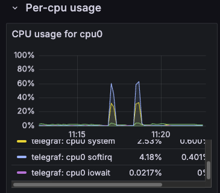
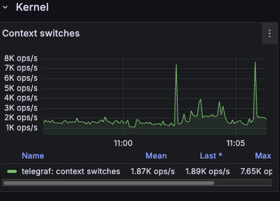
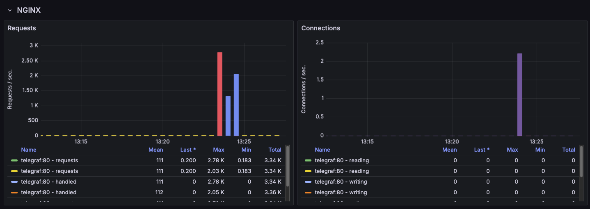
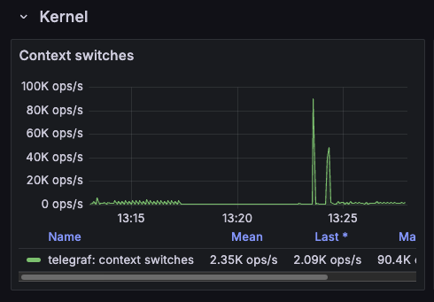
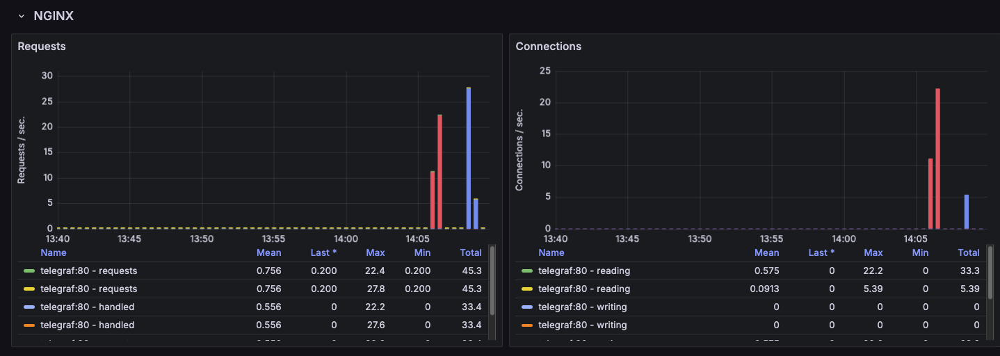

## Project Overview

This project simulates & mitigates real-world DDoS attacks (UDP Flood, ICMP flood, HTTP flood, Slowloris, SYN flood,  Ping of Death) on NGINX servers using docker based infrastructure.

**Key Components:**
- Attacker Container (`hping3`) -> Generates DDoS traffic.
- Defender Containers (`nginx_insecure` & `nginx_secure`) -> Test NGINX protection strategies.
- Monitoring (TIG stack) -> Captures attack impact.


**Secure server configuration and its protections:**

1. Request rate limiting (mitigates HTTP flood/Brute force attacks)

`imit_req_zone $binary_remote_addr zone=one:10m rate=30r/m;`

2. Connection limiting (mitigates high volume attacks)

`limit_conn_zone $binary_remote_addr zone=addr:10m;`

3. Client timeout configuration (mitigates slowloris and slow HTTP attacks)

```
    client_body_timeout 5s;
    client_header_timeout 5s;
    keepalive_timeout 5s;
```

4. (optional) Blocking specific exploit-prone URLs 

```
location /foo.php {
    deny all;
}
```

5. (optional) Blocking malicious user agents 

```
if ($http_user_agent ~* test|python) {
    return 403;
}
```
____

## How to Use

**Setup environment**

```
docker-compose up --build -d
```

### Run attacks inside docker

```
    docker exec -it attacker sh
```

**1. UDP flood**

Overwhelm NGINX with massive UDP packets.

```
    hping3 --flood --rand-source -2 -p 80 nginx_insecure

    hping3 --flood --rand-source -2 -p 80 nginx_secure
```
We see the same CPU switches & usage spikes for both `nginx_insecure` and `nginx_secure` servers:

 

So, NGINX does not mitigate UDP flood attacks, here is why:
- NGINX mainly handles TCP-based HTTP/S requests.
- UDP Flood attacks target network resources rather than the web server.

To protect against UDP flood attacks we can use:
- Firewall rules (iptables, UFW)
- Cloud-based DDoS protection
- Kernel tuning to limit UDP buffer overflow

**2. ICMP (Ping) flood**

Overwhelm NGINX with ICMP Echo Requests (ping packets).

```
hping3 --flood --rand-source -1 nginx_insecure

hping3 --flood --rand-source -1 nginx_secure
```

The same results due to the fact that UDP/ICMP Floods overload the operating system network stack before they even reach NGINX application layer. 

**3. SYN flood**

Consume NGINX TCP connection table by flooding with half-open SYN requests.

```
hping3 --flood --rand-source -S -p 80 nginx_insecure

hping3 --flood --rand-source -S -p 80 nginx_secure
```

Grafana metrics don't show any significant increase in Network Usage, Packets, Drops, Errors or TCP connection states during the SYN flood test. 

**4. HTTP flood**

Overload NGINX by making a massive number of HTTP requests.

```
ab -n 100000 -c 1000 http://nginx_insecure/

ab -n 100000 -c 1000 http://nginx_secure/
```

 

Grafana metrics show:
- One spike in NGINX requests & connections for the insecure server.
- Two spikes in kernel context switches.
- Noticeably spikes in CPU and Memory usage for both servers. 

**NGINX requests & connections results:**
`nginx_insecure` server processes as many requests as the system allows, without rejecting or limiting them, leading to a single burst. 
`nginx_secure` server has `limit_req_zone` and `limit_conn`, which means it limits or rejects excess connections.

**Kernel context switches:**
`nginx_insecure` server processes all requests normally, leading to a single spike.
`nginx_secure` applies rate-limiting & rejection, triggering extra kernel activity (second smaller spike)  

*Even though the secure server processes fewer requests, CPU and memory still spike because denying attacks is still resource-intensive*

**5. Slowloris attack**

Hold connections open as long as possible, preventing legitimate users from connecting.

Run `pip3 install slowloris` inside continer. 

Wrap `slowloris` in a loop to control request rate and keep opening sockets at a rate close to 200 per second.

```
while true; do slowloris nginx_insecure -s 1000 -p 80 --sleeptime 50; sleep 0.005; done

while true; do slowloris nginx_secure -s 1000 -p 80 --sleeptime 50; sleep 0.005; done
```



Grafana metrics show:
- First spike (red) -> Insecure server
- Second spike (blue) -> Secure server
- No significant CPU or memory spikes during the attack

Secure server resisted **slowloris** better but still logged a spike.
Even with protection mechanisms (`limit_conn`, `keepalive_timeout` and `client_header_timeout`), rate limiting helped, but didn’t fully eliminate the attack.

*Further optimizations in timeouts & iptables can improve mitigation.*

**6. Ping of death**

Send oversized ICMP packets that may crash NGINX or overload the system.
 
```
docker exec -it attacker fping -b 65500 -c 10000 -p 10 nginx_insecure

docker exec -it attacker fping -b 65500 -c 10000 -p 10 nginx_secure
```
 
Looks like modern linux kernels or networking stacks automatically block oversized ICMP packets. 
Ping of death attack is not affecting the `nginx_insecure` or `nginx_secure` servers. 
