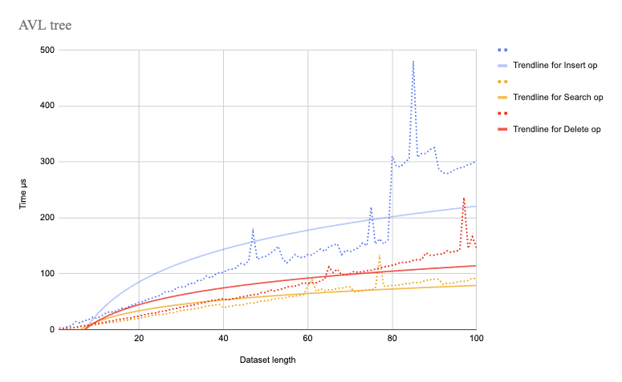
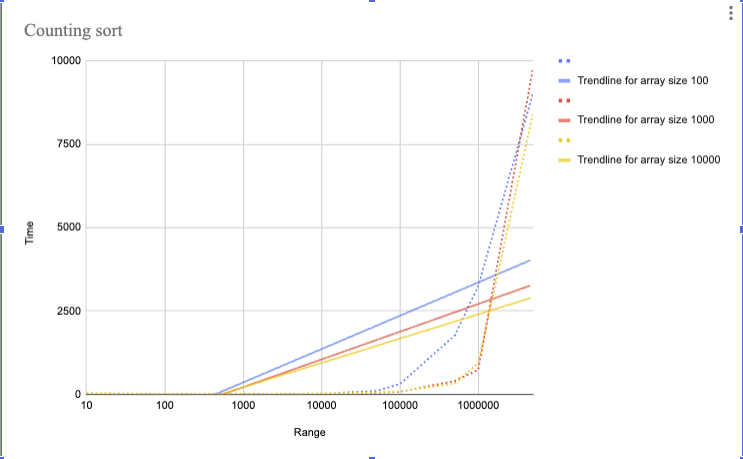

## Project Overview

This project implements and analyzes the **Counting sort** algorithm and a **Balanced AVL Tree**, focusing on their efficiency and performance trends. **AVL Tree** supports `insert`, `search`, and `delete` operations, while **Counting sort** is evaluated under varying dataset `sizes (n)` and value `ranges (k)`. 

____

### Observations from operations performance trends (logarithmic trendline):

The logarithmic trendline confirms that **search**, **insert**, and **delete** operations in the AVL tree are performing close to `O(log(n))` complexity.

However, the execution spikes suggest additional overhead, likely due to:
- Balancing operations (especially for **insert** operation, spike could be happening due to a sequence of insertions that forces multiple rebalances).
- Memory/cache effects (may causing sudden hardware-related slowdowns).

____

### Observations from counting sort performance trends

All dataset sizes (`n`) show similar increasing trends as `k` grows  
This confirms that range (`k`) dominates the complexity, aligning with `O(n + k)`

**Key insights from the charts:**
- When `range` <= n, Counting sort performs well.
- When `range` > n, execution time increases rapidly.
