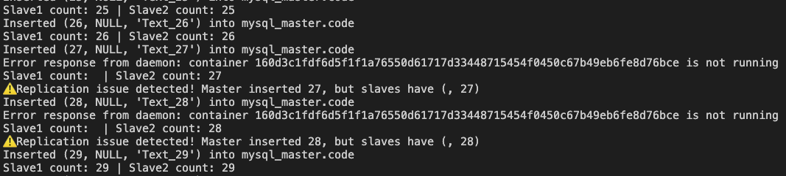
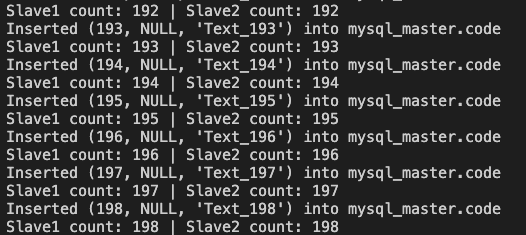
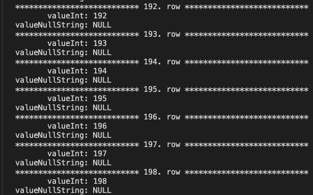
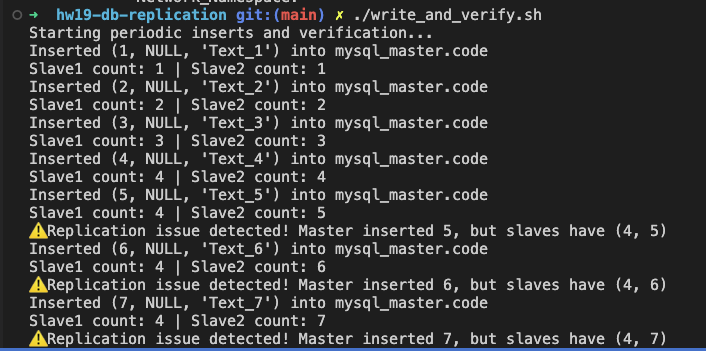

## Project overview

This project sets up a MySQL Master-Slave replication cluster using docker, with one master and two slave replicas. It ensures data consistency across nodes and allows testing of MySQL replication behavior. A shell script `write_and_verify.sh` continuously inserts data into the master and verifies that both slaves correctly replicate changes. 
Project demonstrates how column deletions affect replication and how MySQL handles column shifts in binlog updates. The findings provide insights into MySQL internal data storage and replication mechanics.

___

## How to use

**1. Setup and start the MySQL replication cluster**

`./setup_mysql_replication.sh`

This will:
- Start MySQL master and two slave replicas (`mysql_slave` and `mysql_slave2`).
- Configure replication between the master and both slaves.

**2. Verify replication with continuous inserts**

`./write_and_verify.sh`

This script:
- Continuously inserts records into mysql_master.
- Checks if both slaves correctly replicate the data.
- Reports any replication issues.

**3. Simulate a slave failure and recovery**

 `docker stop mysql_slave`

- `mysql_slave` will stop receiving updates.
- `mysql_slave2` should continue receiving updates without issues.

Restart the slave:

`docker start mysql_slave`


Check its replication `mysql_slave` status:

`docker exec mysql_slave sh -c "export MYSQL_PWD=111; mysql -u root -e 'SHOW SLAVE STATUS \G'"`

Expected output:

```
Slave_IO_Running: Yes
Slave_SQL_Running: Yes
...
`Seconds_Behind_Master: 0`
```
so replication resumed successfully.


Expected output from running `./write_and_verify.sh` script after stop and restart `mysql_slave` replica: 



___

## Running tests

### Test 1: Dropping columns from the right (from last to first)

**1. Drop the last column (`valueString`) on `mysql_slave`:**
```
docker exec mysql_slave sh -c "export MYSQL_PWD=111; mysql -u root mydb -e 'ALTER TABLE code DROP COLUMN valueString;'"
```

Replication not stops. Expected output from running `./write_and_verify.sh` script:



Check `mysql_slave` values. 

```
docker exec mysql_slave sh -c "export MYSQL_PWD=111; mysql -u root mydb -e 'select * from code \G'"
```



**Observation:**

- Table `mysql_slave` still contains `valueInt` and `valueNullString`, replication continues without errors.
- Column deletion is not breaking replication because the mysql binlog applies updates only to existing columns.

**2. Drop the next column (`valueNullString`) on `mysql_slave`:**
```
docker exec mysql_slave sh -c "export MYSQL_PWD=111; mysql -u root mydb -e 'ALTER TABLE code DROP COLUMN valueNullString;'"
```

**Observation:**
- Only `valueInt` remains in the table.
- Replication still works fine, meaning column deletions from the rightmost side do not cause issues.

*Cannot delete the last remaining column, as mysql requires at least one column in a table*

### Test 2: Dropping the first column (`valueInt`)

**1. Try dropping valueInt on mysql_slave:**
```
docker exec mysql_slave sh -c "export MYSQL_PWD=111; mysql -u root mydb -e 'ALTER TABLE code DROP COLUMN valueInt;'"
```

Error encountered: `Column 0 of table 'mydb.code' cannot be converted from type 'int' to type 'text', Error_code: MY-013146`.
Replication stops immediately.



**Reason:** 

Looks like binary log expects an `INT` in column 0, but after deletion, `valueNullString` shifts left and mysql cannot cast a `TEXT` column into `INT`.

### Test 3: Adding an extra integer column and deleting text columns

**1. Modify the table schema on the master by adding an extra INT column (`valueInt2`):**
```
docker exec mysql_master sh -c "export MYSQL_PWD=$MYSQL_ROOT_PWD; mysql -u root $DB_NAME -e 'DROP TABLE IF EXISTS code; CREATE TABLE code(valueInt INT, valueNullString TEXT NULL, valueString TEXT, valueInt2 INT);'"
```

**2. Delete `valueNullString` on `mysql_slave`:**
```
docker exec mysql_slave sh -c "export MYSQL_PWD=111; mysql -u root mydb -e 'ALTER TABLE code DROP COLUMN valueNullString;'"
```

Error encountered: `Column 2 of table 'mydb.code' cannot be converted from type 'blob' to type 'int', Error_code: MY-013146`

**Reason:** 

- Replication stops because `valueString` (which is `TEXT`) shifts left and tries to occupy an `INT` position (`valueInt2`).
- Same error happens if we delete `valueString` first.

**Additional insight:**

In MySQL InnoDB engine, `TEXT` data types are internally stored as `BLOB` columns, that's why we have `'blob' to type 'int'` conversion in error message.

___

### Final conclusions

1. Stopping a slave (`mysql_slave`) does not break replication.
2. Dropping columns from the rightmost side does not break replication, but dropping from the left causes data shifts that break replication.
3. Column deletions cause leftward shifts in mysql replicas.

    3.1. If the shifted data type does not match the original expectation in the binlog, replication fails. 