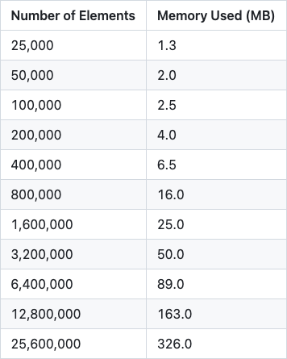

## Project overview 

This project analyzes performance of an AVL Tree using pprof profiling, benchmarking with testing.B, and runtime execution time measurements. The collected data confirms the `O(log n)` time complexity for operations and `O(n)` space complexity.

___

### Analysis of AVL Tree efficiency

**1. Memory profiling with `pprof`**

Memory heap usage clearly demonstrates a gradual increase following `O(n)` complexity, the results were derived from 10 different data points to effectively capture this trend.

The following table & chart presents the memory usage:
 

  
  
  

**2. Time profiling using time package**

A logarithmic trendline constructed from 100 measurements for insert/search/delete operations, validates the expected `O(log n)` time complexity of the AVL Tree.

| Search |
|--------------------|
|  |

| Insert | Delete |
|--------------------|-----------------|
|  |      |

