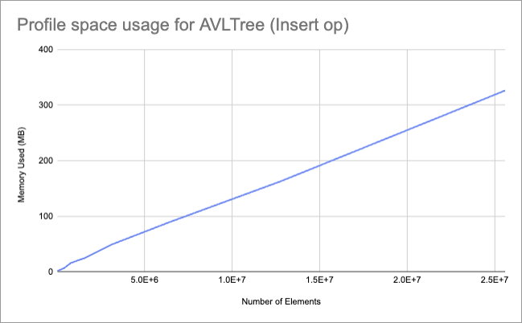
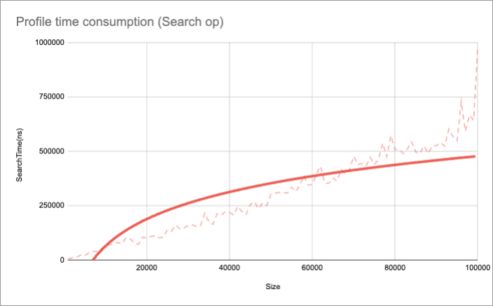
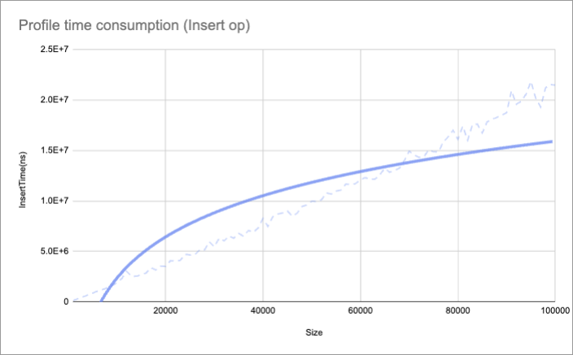
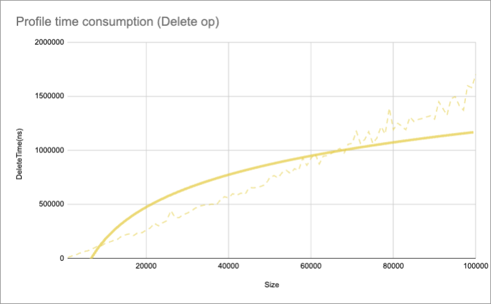

## Project overview 

This project analyzes performance of an AVL Tree using pprof profiling, benchmarking with testing.B, and runtime execution time measurements. The collected data confirms the `O(log n)` time complexity for operations and `O(n)` space complexity.

___

### Analysis of AVL Tree efficiency

1. Memory profiling with `pprof`

Memory heap usage clearly demonstrates a gradual increase following `O(n)` complexity, the results were derived from 10 different data points to effectively capture this trend.

The following table & chart presents the memory usage 

| Number of Elements | Memory Used (MB) |
|--------------------|-----------------|
| 25,000           | 1.3             |
| 50,000           | 2.0             |
| 100,000          | 2.5             |
| 200,000          | 4.0             |
| 400,000          | 6.5             |
| 800,000          | 16.0            |
| 1,600,000        | 25.0            |
| 3,200,000        | 50.0            |
| 6,400,000        | 89.0            |
| 12,800,000       | 163.0           |
| 25,600,000       | 326.0           |

2.	Time profiling using time package

A logarithmic trendline constructed from 100 measurements for insert/search/delete operations, validates the expected `O(log n)` time complexity of the AVL Tree.

| Search |
|--------------------|
|  |

| Insert | Delete |
|--------------------|-----------------|
|  |      |

