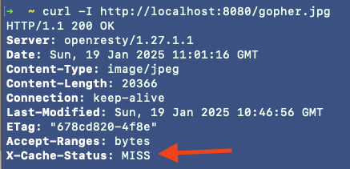
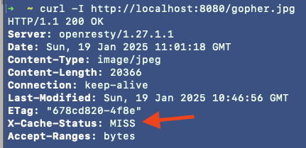
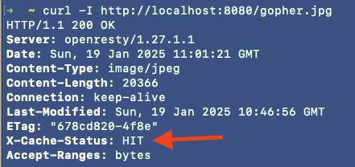
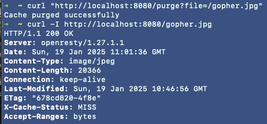

## Project Overview

This project demonstrates Nginx cache management with advanced functionality for caching content after multiple requests and purging specific cached files. It uses Docker Compose to set up the environment and provides examples to test caching behavior.

### How to Use

**1. Start the Environment**

Run `docker-compose up` to spin up the project

**2. Test Caching Behavior**

Make the first request to a resource (e.g., gopher.jpg):

```
curl -I http://localhost:8080/gopher.jpg
```


The first request will return a MISS cache status, indicating the file was not yet cached.

Make a second request to the same resource:
```
curl -I http://localhost:8080/gopher.jpg
```


The second request will also return a MISS cache status. This is expected, as the cache is only created after the specified number of uses.

Make the third request:
```
curl -I http://localhost:8080/gopher.jpg
```

The third request will return a HIT cache status, indicating the file has now been cached successfully.

**3. Purge Cache for a Specific File**

To purge the cache for a specific file, use the following command:
```
curl "http://localhost:8080/purge?file=/gopher.jpg"
```


**4. Verify Cache is Cleared**
After purging, make a new request to the same file:
```
curl -I http://localhost:8080/gopher.jpg
```


The request will return a MISS cache status, indicating the cache has been cleared and the file is deleted.